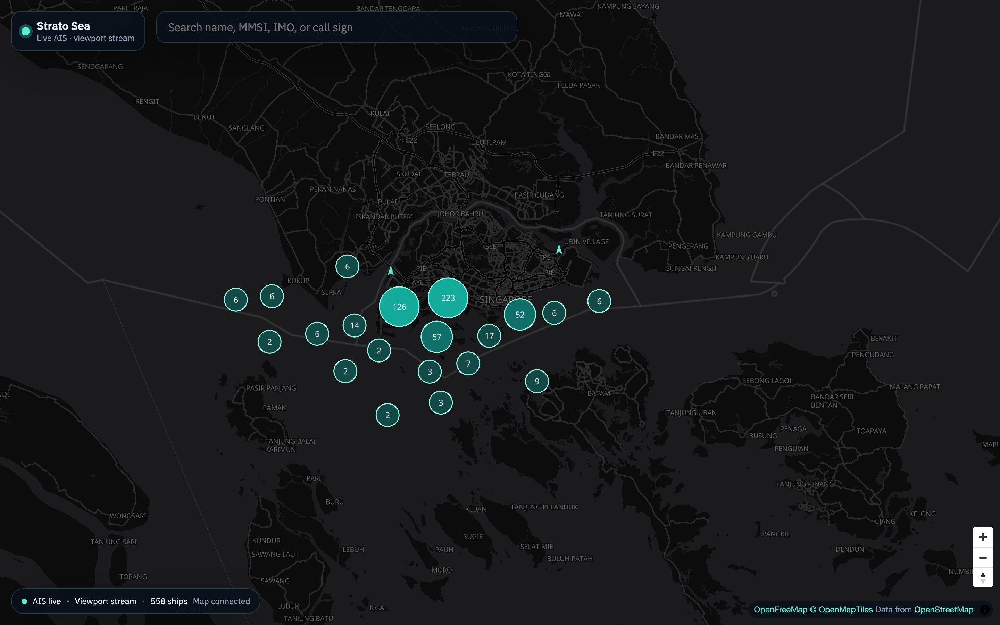
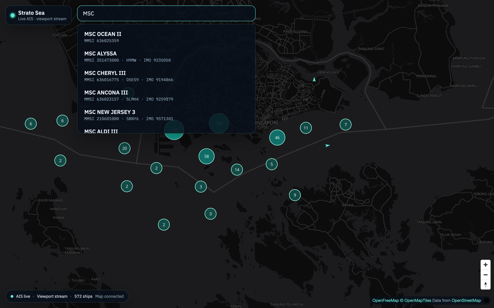
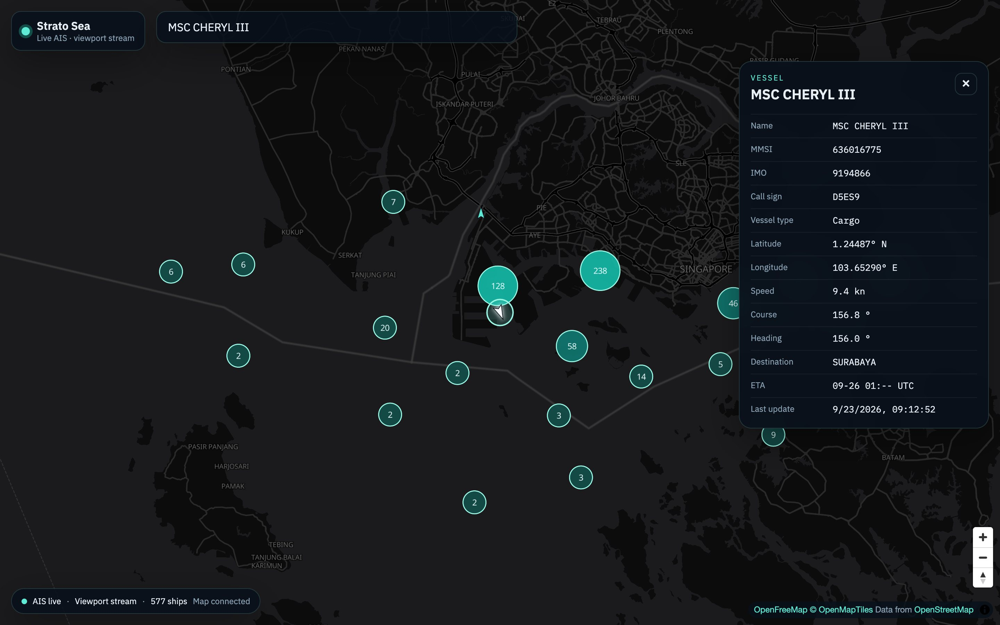

# Strato Sea

Live ship tracking on a full-screen map: [strato-sea.vercel.app](https://strato-sea.vercel.app). The browser only receives vessels inside the current view, and the [AISStream](https://aisstream.io) API key stays on the FastAPI backend.



Zoomed-out world views do not subscribe to the worldwide AIS feed. Zoom in (about zoom 5+, and a limited geographic span) and ships in that box start streaming. Crossing the antimeridian splits the viewport into two AIS bounding boxes. A small buffer around the viewport keeps ships from vanishing at the edge.

## Screenshots

Search ships already seen in the live store, by name, MMSI, IMO, or call sign.



Selecting a result centers the map, highlights the marker, and opens course, speed, and destination.



## Stack

- React, TypeScript, and Vite
- MapLibre GL, with a dark [MapTiler](https://www.maptiler.com/) basemap or an [OpenFreeMap](https://openfreemap.org) fallback
- FastAPI WebSocket hub that subscribes to AISStream for the current viewport
- In-memory vessel store with search and a short time-to-live

## Architecture

```
User pans / zooms map
        ↓
MapLibre bounding box (debounced)
        ↓
React WebSocket → FastAPI
        ↓
FastAPI updates AISStream subscription
        ↓
AISStream sends matching AIS messages
        ↓
FastAPI vessel store + geographic filter
        ↓
React updates MapLibre markers
```

## Setup

1. Copy `.env.example` to `.env` and set `AISSTREAM_API_KEY`. Get a key at [aisstream.io](https://aisstream.io/).
2. Backend:

```bash
cd backend
python3 -m venv .venv
source .venv/bin/activate
pip install -r requirements.txt
uvicorn main:app --reload --port 8000
```

3. Frontend:

```bash
cd frontend
npm install
npm run dev
```

Open [http://localhost:5173](http://localhost:5173). Vite proxies `/api` and `/ws` to FastAPI.

### Base map (MapTiler)

The map uses OpenStreetMap data. For the dark vector basemap, create a free MapTiler key:

1. Sign up at [https://cloud.maptiler.com/auth/widget](https://cloud.maptiler.com/auth/widget)
2. Open [API keys](https://cloud.maptiler.com/account/keys/)
3. Click **New key**, name it `strato-sea`, and create it
4. Copy the key into `frontend/.env`:

```bash
cd frontend
cp .env.example .env
```

```
VITE_MAPTILER_API_KEY=your_key_here
```

5. Restart the Vite dev server (`npm run dev`)

Without a MapTiler key, the app falls back to OpenFreeMap dark OSM tiles.

## License

MIT. See [LICENSE](LICENSE).
